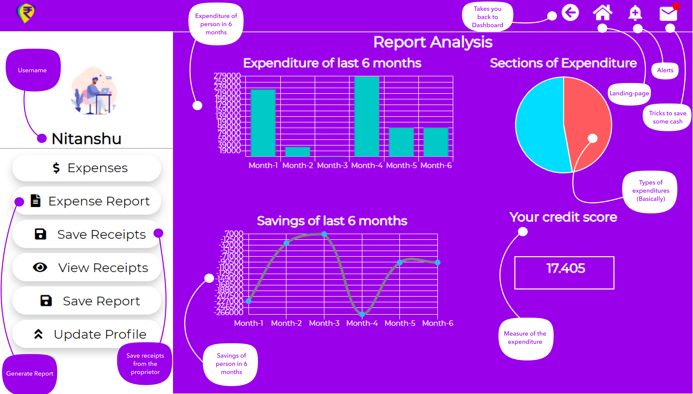

# NHDD
# Problem statement : 

In today’s world nothing is free we has to pay for each and every thing we buy out.

We had expenses day to day.  
Now let’s consider a household situation :

each day we buy some fruits , vegetables(daily needs) etc or when our accessories got old/broken we buy a set of new one (not daily but frequently may be once/twice in a week ) all those expenses are crucial from household perspective this expenses are considerable and contribute towards building up a monthly records of expense generally this expense records are managed one of the family member .he manages day to day expense records and at the end of each month he tries to analyze it by making certain calculation on those expense such as adding all expenses and subtracting it with monthly income to get an roundoff figure saying whether this month is in profit or loss.

Generally all those task proves to be hectic as one has to analyze/make arithmetic assumptions on those records which mainly proves to be a hectic task

Also for managing records one needs to hold it on a notebook and a pen which drives over it and buying this too add up a considerable expense .Also for analyzing records it takes a considerable amount of time and human effort. Also human efforts are prone to calculation mistakes.   

Challenges our solution has deal with: 

Maintaining records .
Analyse the records .
Update records .
extra cost of buying a notebook and a pen.
Calculation mistakes.
Time saving.

# Solution :

Accompained with 

 

## Inference out of credit score : 
### less than 32 - fall more than 75%

### 32 - 35.5 - fall of almost 75%

### 37 - 40 - fall of almost 50%

### 41 - 44 - fall of almost 25%

### 45 - 48 - fall is about 10%

### 50 - no change (almost constant with average)

### 52 - 55 - growth of almost 25% 

### 56.5 - 60 - growth of almost 50%

### 61 - 64.5 - growth of almost 75%

### 65.5 - 70 - almost doubled the current status

### 70 - 74 - almost 3x growth

### 75 - very high growth

BTW you are thinking where is Oops :confused: it is used in javascript and php codes
