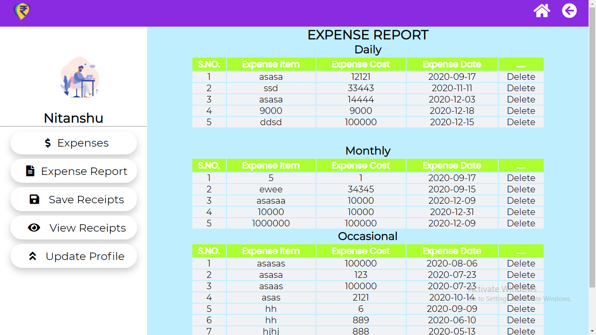
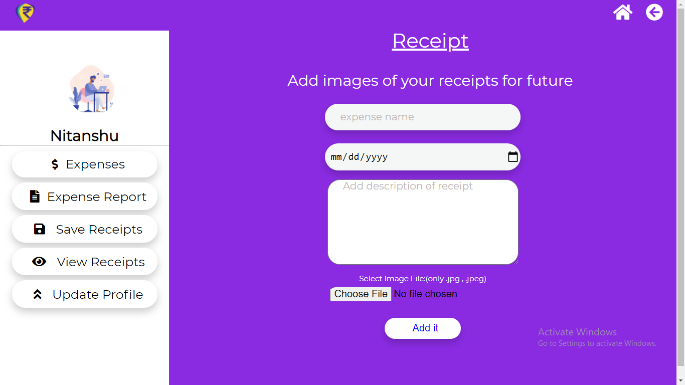
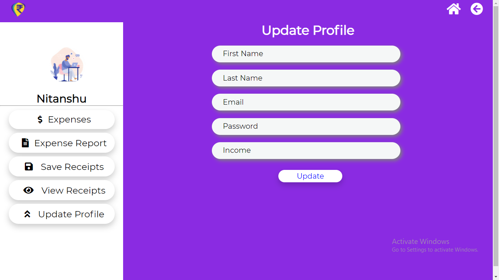
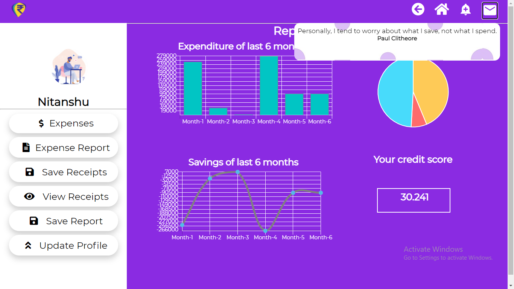
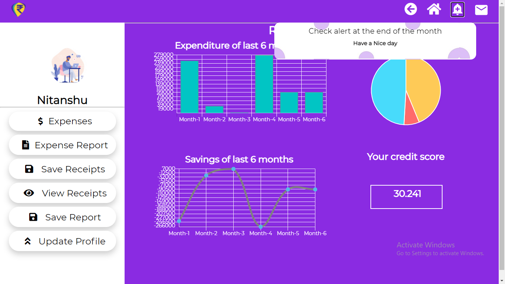

# NHDD 
# Introduction: Inspiration behind idea
We have to pay for each and everything we buy in today’s world.
Let’s consider a household situation:
Every day we buy some fruits, vegetables (things of daily needs) etc or when our
accessories get old/broken we buy a set of new one. All these expenses are important from
household perspective as they are crucial and contribute towards building up monthly records
of household expenditures.

Now think about the family member that manages it all. He\she manages day to day
expense records and at the end of each month, tries to analyze it by making certain calculation
on those expenses such as adding them all and then subtracting them from monthly income to
get some round off figure to analyze this month’s profit or loss.
Generally, all these tasks are very hectic and exhausting as one has to store and analyze
all of these making it cumbersome and inefficient.
Wrong calculations being the worse part.

# Defining: Problem statement

Referring to the above inspiration our main goal was to create a web application portal
where user can save his\her expense in a very efficient way such that those records don’t
mess up and at the end user should be able to get some meaningful inference about the
expenses. Also, he\she should be able to compare the expenses record of the previous months
with the current month.

Extending the idea, we also thought to provide the user with the facility to save his\her
receipts so that he\she can retrieve them in the future whenever they need it because most of
the times these receipts get lost at the most important moments. 

Our main goal in this project was to provide the user with facilities of:

1) Saving his\her expenditure records in an efficient way.
2) Analysis of the saved records which covers:
  -  Finding meaningful inference from the saved records.
  -  Being able to compare the expenditure/savings of current month with that of previous
     months.
  -  Finding a budget deviation figure at the end of each month.
  -  Finding a credit score figure comparing the overall state of savings and expense of
current month with that of previous months.
3) To update and retrieve the previously saved records.
4) Privacy - by providing proper login credentials.
5) Extra features which provide accessibility to:
a) Save important receipts with pictures in our database.
b) Retrieve the receipts at once or date wise.
6) Download report to save it for future reference.

# Getting Towards: Solution

To tackle all the discussed challenges and to make life more comfortable we came up
with NHDD.com which is nothing but a portal accompanied with all the facilities discussed in
the problem statement. NHDD.com is a portal made with booming web technologies like
HTML5, CSS3 , Vanilla Javascript, PHP and My Sql as its database for storing records. Through
NHDD.com user can save records, update records, retrieve records, find meaning full inference
out of the records, get the deviation and overall expense + savings figure, save receipt,
retrieve receipts and can maintain his\her privacy by proper login credentials.
NHDD.com accompanied with certain features as:

1. Saving and updating records.
2. Downloading report.
3. Retrieving records.
4. Getting deviation figure at the end of each month.
5. Getting a proper credit score defining the saving + expense history.
6. Compare current month records with that of previous month records.
7. User can save some important receipts.
8. Retrieving all receipts at one or date wise.
9. Analyze expenses all at once or between certain dates.

# Solution :

Accompained with 

## Demonstration:

 

## Inference out of credit score : 
### less than 32 - fall more than 75%

### 32 - 35.5 - fall of almost 75%

### 37 - 40 - fall of almost 50%

### 41 - 44 - fall of almost 25%

### 45 - 48 - fall is about 10%

### 50 - no change (almost constant with average)

### 52 - 55 - growth of almost 25% 

### 56.5 - 60 - growth of almost 50%

### 61 - 64.5 - growth of almost 75%

### 65.5 - 70 - almost doubled the current status

### 70 - 74 - almost 3x growth

### 75 - very high growth

